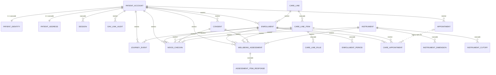

# Mapa do Banco de Dados — `renovi_care`

> Reconstruído a partir das 14 migrations em `apps/api/internal/db/migrations`
> (fonte da verdade do schema). PostgreSQL 17 (Neon). Gerado em 2026-07-20.

**22 tabelas** em **7 domínios** · **14 migrations** · **1 role restrito** (`renovi_app`)

## Domínios

1. [Autenticação & Identidade](#1-autenticação--identidade) — `0002_auth`
2. [Agendamento](#2-agendamento) — `0003_scheduling`, `0004_release_guard`
3. [Catálogo de Linhas de Cuidado](#3-catálogo-de-linhas-de-cuidado) — `0005_care_line`, `0009_activity_item`
4. [Matrícula](#4-matrícula) — `0006_enrollment`
5. [Jornada do Paciente](#5-jornada-do-paciente) — `0007_care_journey`, `0012`–`0014`
6. [Consentimento (LGPD)](#6-consentimento-lgpd) — `0010_consent`
7. [Verificador de Humor & Wellbeing](#7-verificador-de-humor--wellbeing) — `0011`–`0013`

**Legenda:** `PK` chave primária · `FK → tabela (CASCADE/RESTRICT)` chave estrangeira e
comportamento em `ON DELETE` · `único` = constraint de unicidade.

---

## 1. Autenticação & Identidade

Conta do paciente, dados de identidade isolados por LGPD, endereço, sessão opaca
(ADR-010) e a auditoria de todo vínculo com a Doutor ao Vivo (DAV).

### `patient_account` — PK `id`
A conta do paciente. Só fica utilizável (`ACTIVE`) com vínculo confirmado na DAV —
o banco recusa o contrário (`CONSTRAINT active_exige_vinculo_dav`).

| Coluna | Tipo / regra |
|---|---|
| `email` | TEXT · único (`lower`/`btrim`) |
| `phone`, `birth_date` | TEXT, DATE |
| `password_hash` | TEXT · Argon2id (formato PHC) |
| `status` | CHECK · `PENDING_DAV`, `ACTIVE`, `BLOCKED` |
| `dav_person_id` | TEXT · único |
| `dav_link_origin` | CHECK · `CREATED`, `ATTACHED` |
| `verified_at` | TIMESTAMPTZ |
| `failed_login_count`, `locked_until` | trava progressiva de login |

### `patient_identity` — PK/FK `account_id`
CPF isolado da conta — *"CPF só em tabelas de identidade"* (LGPD, `CLAUDE.md`).

- `account_id` → `patient_account.id` **CASCADE**
- `cpf` — CHAR(11) · único
- `cpf_hmac` — BYTEA(32) · nulo · único parcial (`WHERE NOT NULL`) — HMAC-SHA256 do
  CPF (pepper compartilhado, `0016`/ADR-043); casa a pessoa com a Gestão sem CPF em
  claro. Nulo até o cadastro/backfill gravar.

### `patient_address` — PK/FK `account_id`
Endereço 1:1 com a conta.

- `account_id` → `patient_account.id` **CASCADE**
- `zip_code` CHAR(8), `state` CHAR(2) — validados por CHECK
- `street`, `number`, `complement`, `neighborhood`, `city`, `country`

### `session` — PK `id`
Sessão opaca (ADR-010): só o hash do token é gravado, nunca o token.

- `account_id` → `patient_account.id` **CASCADE**
- `token_hash` — BYTEA(32) · único · SHA-256
- `expires_at`, `revoked_at`, `last_seen_at`

### `dav_link_audit` — PK `id`
Trilha de todo vínculo com a DAV — quem anexou o quê, e de onde.

- `account_id` → `patient_account.id` **RESTRICT** (deliberado: apagar a conta não
  pode apagar a evidência)
- `origin` — CHECK · `CREATED`, `ATTACHED`
- `request_ip` — INET

---

## 2. Agendamento

O espelho local das consultas — amarra o MySQL legado (slot), a DAV (appointment)
e o paciente. Único lugar que conhece os três.

### `appointment` — PK `id`
A saga técnica da reserva. IDs do legado/DAV são só `TEXT` — sistemas externos
nunca ganham FK.

| Coluna | Tipo / regra |
|---|---|
| `account_id` | → `patient_account.id` **RESTRICT** |
| `legacy_slot_id`, `legacy_professional_id`, `legacy_specialty_id` | TEXT · chaves do MySQL legado |
| `professional_name`, `specialty_name` | fotografia do legado no momento do agendamento |
| `status` | CHECK · `PENDING_SLOT`, `DAV_PENDING`, `CONFIRMED`, `FAILED`, `DAV_UNKNOWN`, `CANCELLED` |
| `dav_appointment_id` | TEXT · único |
| `patient_join_url` | TEXT · credencial (nunca em log/listagem) |
| `slot_held_at`, `slot_released_at`, `dav_attempted_at`, `confirmed_at` | trilha da saga para o worker compensar |

Único parcial em `legacy_slot_id` (estados vivos) — trava do nosso double-booking.
`0004` endurece a liberação: só estado terminal pode ter `slot_released_at`.

---

## 3. Catálogo de Linhas de Cuidado

O catálogo versionado e imutável: publicar não altera a versão anterior, cria a
próxima.

### `care_line` — PK `id`
Uma linha de cuidado (ex.: "gestante"). Versionada por (`code`, `version`).

- `code`, `version` — único (`code`, `version`)
- `status` — CHECK · `draft`, `published`
- `published_at` — TIMESTAMPTZ
- Único *draft* por `code` — dois admins não competem pela mesma versão nova.

### `care_line_item` — PK `id`
Item dentro da linha — referenciado por regras e pela jornada via `ref`.

- `care_line_id` → `care_line.id` **CASCADE**
- `ref` — TEXT · único por linha
- `kind` — CHECK · `CONSULTA`, `ATIVIDADE` (estendido em `0009`)
- `specialty_code` — condicional: exigido só se `kind = CONSULTA`

### `care_line_rule` — PK `id`
A regra de elegibilidade avaliada pelo motor puro (`models/careline`).

- `care_line_item_id` → `care_line_item.id` **CASCADE**
- `rule_type` — CHECK · `QUOTA`, `MIN_INTERVAL`, `MAX_ADVANCE`, `PREREQUISITE`
- `params` — JSONB

---

## 4. Matrícula

Amarra o paciente a uma versão específica do catálogo, com janela de vigência.

### `enrollment` — PK `id`
No máximo uma matrícula viva por (paciente, `care_line_code`) — vale entre versões.

| Coluna | Tipo / regra |
|---|---|
| `patient_id` | → `patient_account.id` **RESTRICT** |
| `care_line_id` | → `care_line.id` **RESTRICT** |
| `care_line_code` | TEXT · redundante ao id (trava vale entre versões) |
| `status` | CHECK · `ativa`, `pausada`, `concluida`, `encerrada`, `expirada` |
| `valid_from`, `valid_until` | TIMESTAMPTZ |
| `gestao_contract_id` | TEXT · opcional (piloto matricula antes da integração Gestão) |

Único (`patient_id`, `care_line_code`) parcial para status `ativa`/`pausada`.

### `enrollment_period` — PK `id`
Janelas de vigência da matrícula (renovações).

- `enrollment_id` → `enrollment.id` **CASCADE**
- `starts_at`, `ends_at` — TIMESTAMPTZ
- `source` — CHECK · `admin`

> **Linha universal + matrícula automática (Degrau 1, ADR-040 · migration `0015`).**
> A migration `0015_universal_mental_health` semeia uma linha publicada
> `saude-mental-aberta` com os 3 itens ATIVIDADE do Verificador de Humor
> (`checkin-humor-diario`, `who5-semanal`, `phq4-gatilhado`) e matricula **todo
> colaborador** nela: contas novas via hook em `AccountStore.commitLink` (mesma TX da
> ativação, idempotente e *fail-open*); contas `ACTIVE` existentes via backfill na
> própria `0015`. A vigência é **perpétua** por `valid_until` distante
> (`2999-12-31`, não `infinity` — pgx v5 não faz scan de `infinity` em `time.Time`),
> então o motor `VIGENCIA` nunca bloqueia e a expiração lazy nunca dispara. Essa
> matrícula é **excluída** da listagem da jornada
> (`JourneyRepo.ListEnrollmentsByPatient`), logo **não** conta como "plano" no perfil —
> o humor lê o endpoint separado `/me/mood/today`. O gate de consentimento LGPD
> (`checkin_humor`) permanece.

---

## 5. Jornada do Paciente

A projeção clínica do que foi realizado, e o log append-only da linha do tempo.

### `care_appointment` — PK `id`
A consulta da jornada, amarrada à matrícula e ao item do catálogo.

| Coluna | Tipo / regra |
|---|---|
| `enrollment_id` | → `enrollment.id` **RESTRICT** |
| `care_line_item_id` | → `care_line_item.id` **RESTRICT** |
| `booking_id` | → `appointment.id` — **referência lógica, sem FK** (ADR-012: desacopla o módulo de agendamento) |
| `status` | CHECK · `agendada`, `confirmada`, `em_andamento`, `realizada`, `falta`, `cancelada` |
| `idempotency_key` | TEXT · único por matrícula (parcial) |

### `journey_event` — PK `id` (UUID v7)
Log append-only da jornada — alimenta a tela do paciente e a auditoria.

| Coluna | Tipo / regra |
|---|---|
| `enrollment_id` | → `enrollment.id` **RESTRICT** |
| `patient_id` | → `patient_account.id` **RESTRICT** |
| `event_type` | CHECK · 11 valores, cresce a cada migration (matrícula, consulta, `checkin_humor_registrado`, `assessment_respondido`, `pedido_ajuda`, `escalonamento_clinico`) |
| `actor` | CHECK · `paciente`, `sistema`, `admin` |
| `ref_table`, `ref_id` | ponteiro fraco ao objeto que originou o evento |
| `payload` | JSONB |

**SOMENTE INSERÇÃO** — `UPDATE`/`DELETE` revogados do role `renovi_app` em `0008`
(imposto no banco, não por disciplina de código).

---

## 6. Consentimento (LGPD)

Pré-condição de gravação de dado sensível (art. 11) — versionado e revogável.

### `consent` — PK `id`
Sem consentimento ativo para a finalidade, nenhuma resposta sensível é persistida.

- `patient_id` → `patient_account.id` **RESTRICT**
- `finalidade` — TEXT (ex.: `checkin_humor`)
- `versao_termo` — TEXT
- `status` — CHECK · `ativo`, `revogado`
- Único (`patient_id`, `finalidade`) parcial para status `ativo`.

---

## 7. Verificador de Humor & Wellbeing

Catálogo de instrumentos (GRID, WHO-5, PHQ-4) e a execução dos anéis
diário/semanal/gatilhado.

### `instrument` — PK `id`
Cortes e dimensões vivem em dados versionados, não em código. Seed de 3
instrumentos em `0011`.

- `codigo` — `GRID`, `WHO5`, `PHQ4`
- `anel` — CHECK · `diario`, `semanal`, `gatilhado`
- `ativo` — BOOLEAN · único ativo por código

### `instrument_dimension` — PK `id`
Dimensões medidas por instrumento (valência, energia, depressão…).

- `instrument_id` → `instrument.id` **CASCADE**
- `polaridade` — CHECK · `positiva`, `negativa`

### `instrument_cutoff` — PK `id`
Cortes clínicos com validação BR (ex.: WHO-5 <28 encaminha).

- `instrument_id` → `instrument.id` **CASCADE**
- `operador` — CHECK · `<`, `>=`, `entre`
- `origem_validacao` — TEXT · referência científica

### `emotion_label` — PK `id`
Rótulos de emoção por quadrante — seed, vocabulário próprio da Renovi. Sem FK.

### `context_tag` — PK `id`
Tags de contexto do check-in (trabalho, sono, relações…) — seed. Sem FK.
`chave` é única.

### `mood_checkin` — PK `id`
Execução do anel diário (grade valência × energia). 1 resposta por dia local.

| Coluna | Tipo / regra |
|---|---|
| `patient_id` | → `patient_account.id` **RESTRICT** |
| `enrollment_id` | → `enrollment.id` **RESTRICT** |
| `care_line_item_id` | → `care_line_item.id` **RESTRICT** |
| `consent_id` | → `consent.id` **RESTRICT** |
| `instrument_id` | → `instrument.id` **RESTRICT** |
| `valencia`, `energia` | INT 0–100 |
| `dia_ref` | DATE · dia local (América/São Paulo) |

Único (`patient_id`, `dia_ref`).

### `wellbeing_assessment` — PK `id`
Execução dos anéis periódicos (WHO-5 semanal, PHQ-4 gatilhado).

- mesmas 5 FKs de `mood_checkin` (`patient_id`, `enrollment_id`,
  `care_line_item_id`, `consent_id`, `instrument_id`) — todas **RESTRICT**
- `index_score` — NUMERIC · WHO-5: 0–100, PHQ-4: `NULL`
- `subscores` — JSONB (ex.: PHQ-4 `{"phq2": x, "gad2": y}`)
- `flag_encaminhar` — BOOLEAN

### `assessment_item_response` — PK `id`
Resposta item a item do assessment.

- `assessment_id` → `wellbeing_assessment.id` **CASCADE**
- Único (`assessment_id`, `item_ordem`)

---

## 8. Ingestão da Gestão (push, ADR-043 · migrations `0016`+`0017`)

A Renovi Gestão CHAMA nossa API e nós persistimos aqui (nunca escrevemos no banco
dela). A chave da pessoa é `cpf_hmac`, não o CPF. A `0017` (conclusão do onboarding,
ADR-044) só amplia vocabulário: o status `recusado` e dois novos tipos de evento.

### `gestao_company_link` — PK `id`
A empresa, espelho mínimo do que a Gestão conta.

- `gestao_company_id` — TEXT · único (idempotência do upsert)
- `display_name`

### `gestao_employee_link` — PK `id`
A **pessoa** (1 por CPF, atravessa empresas). `patient_id`/`link_method`/`linked_at`
só são preenchidos quando o onboarding **fecha** (`CloseEmployeeLink`, ADR-044) — no
ingest, **sem auto-vínculo**.

- `cpf_hmac` — BYTEA(32) · único **parcial** `ux_gestao_employee_ativo WHERE status <> 'cancelado'`
  (padrão de `ux_enrollment_viva`: cancelar libera re-onboarding; `recusado` ainda ocupa a trava)
- `invite_name`, `invite_email`, `invite_phone` — snapshot p/ convite/pré-preenchimento
- `patient_id` → `patient_account.id` **RESTRICT** · nulo até vincular
- `status` — CHECK · `pendente`, `vinculado`, `cancelado`, `recusado` (`recusado` = a pessoa
  abriu o convite e disse que NÃO faz parte da empresa — `0017`)
- `link_method` — CHECK · `convite`, `cpf_match` · nulo até vincular
- CHECK `vinculado_completo`: `vinculado` exige `patient_id`+`link_method`+`linked_at`
  (espelha `active_exige_vinculo_dav`)

### `gestao_contract` — PK `id`
O vínculo pessoa×empresa (N:N no tempo; a linha transita, não morre).

- `gestao_contract_id` — TEXT · único (idempotência)
- `gestao_employee_id` — TEXT (snapshot, sem FK — id de outro banco)
- `gestao_employee_link_id` → `gestao_employee_link.id` **RESTRICT**
- `gestao_company_link_id` → `gestao_company_link.id` **RESTRICT**
- `status` — CHECK · `ativo`, `afastado`, `desligado`
- `accepted_at` — aceite do titular p/ ESTA empresa · preenchido na conclusão do
  onboarding (`SetLiveContractsAcceptedByEmployeeLink`, só contratos vivos), ADR-044
- `started_at`, `ended_at` · CHECK `desligado_exige_data` (espelha `cancelada_exige_data`)

### `onboarding_token` — PK `id`
Token do convite (TTL `INVITE_TTL`, 7d). Guarda só o SHA-256, como `session`.

- `gestao_employee_link_id` → `gestao_employee_link.id` **RESTRICT**
- `token_hash` — BYTEA(32) · único · SHA-256 (a conclusão acha o convite por este hash
  — `FindTokenByHash` — e o consome em `used_at`, ADR-044)
- `expires_at`, `used_at`, `revoked_at`
- Único **parcial** `ux_token_vivo WHERE used_at IS NULL AND revoked_at IS NULL` — um
  convite vivo por pessoa (reenvio/recusa revogam; conclusão consome via `used_at`)

### `gestao_ingestion_event` — PK `id`
Trilha **append-only** da ingestão (privilégio, como `journey_event`). NUNCA guarda
CPF em claro — só `cpf_hmac`.

- `event_type` — CHECK · `contrato_recebido`, `convite_emitido`, `convite_reenviado`,
  `cpf_match_pendente`, `onboarding_concluido`, `onboarding_recusado` (os dois últimos, `0017`)
- `gestao_contract_id` TEXT, `gestao_employee_link_id` UUID, `cpf_hmac` BYTEA, `payload` JSONB
- `renovi_app` tem `UPDATE`/`DELETE` revogados nela (`0016`)

## Mapa de relações

Todas as chaves estrangeiras do schema. `emotion_label` e `context_tag` ficam de
fora por não terem FK. A linha pontilhada é a referência lógica sem FK
(`booking_id → appointment`).

---

## Padrões estruturais

Convenções que valem para o schema inteiro (ver também `docs/ARQUITETURA.md`):

- **PK sempre UUID v7**, gerado na aplicação — nunca `gen_random_uuid()` em
  runtime, exceto no seed de `0011`.
- **Timestamps sempre `TIMESTAMPTZ`**; enums via `TEXT + CHECK`, nunca `ENUM`
  nativo — evolui sem `ALTER TYPE`.
- **`ON DELETE RESTRICT` é a regra**, não `CASCADE`. Só 1:1 de identidade e
  filhos de agregados fechados usam CASCADE — o resto recusa apagar em silêncio
  para não perder auditoria ou jornada.
- **Sistemas externos nunca têm FK.** MySQL legado e DAV entram só como `TEXT`,
  fotografados no momento do fato.
- **`care_appointment.booking_id → appointment.id` é proposital sem FK**
  (ADR-012): desacopla o módulo de agendamento do módulo de jornada.
- **`journey_event` é append-only por privilégio de banco**, não por disciplina
  de código — o role `renovi_app` (`0008`) tem `UPDATE`/`DELETE` revogados nela.

---

*Fonte: `apps/api/internal/db/migrations/0001`–`0016` · `renovi_care`
(PostgreSQL 17, Neon) · atualizado em 2026-07-22 (0016: ingestão da Gestão).*
